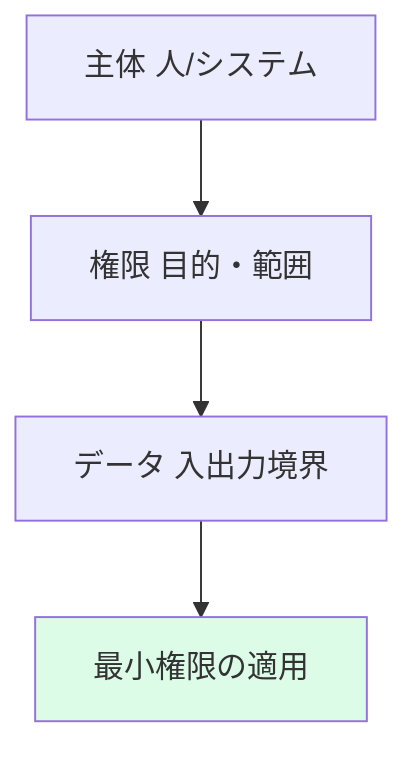

## リード（1段落）

ゼロトラストは「ネットワークの境界で守る」従来型から「主体・権限・データごとに検証する」考え方へ移行しています。AI利用では、**この原則を「誰がどのAIにどのデータでアクセスしてよいか」の申請・承認フローに翻訳する**必要があります。本稿では、Zero TrustをAI利用申請に落とすためのリスク、設計、運用、証跡を整理します。実務担当が明日から使えるチェックリストと責任分界の例も示します。

## 本文

### 1. リスク

AIアクセスを放置すると、**社内のShadow AI（承認外利用）の増加**、機密データの学習・推論への流入、および「誰が何を許可したか」の証跡欠落が起こりやすくなります。リスクとして、最小権限の未設定、申請―審査―承認の形骸化、ログの欠落が代表的です。ここでは、主体（人・システム）×権限（利用目的・データ範囲）×データ（入力・出力の境界）の3軸でリスクを整理し、どこにアクセス制御のゲートを置くかを決める材料にします。

ここに図1を挿入

### 2. 設計

設計では、**AI利用の申請フォーム、審査基準、承認者（RACIのA）、付与・剥奪の手順**を文書化します。ゼロトラストを「AI利用申請へ翻訳」するとは、利用ケースごとに「どのモデル・どのデータ・どの目的」を明示させ、承認後にのみアクセスを付与し、有効期限と棚卸で見直す流れにすることです。設計時に、申請者（R）、承認者（A）、証跡保管（R）を決め、監査で説明できる証憑の形式（申請書・承認ログ・付与記録）を揃えておきます。

ここに図2を挿入

### 3. 運用

運用では、申請―審査―承認のフローを実際に回し、例外（緊急・一時利用）の基準と有効期限を設けます。**例外が増えすぎないよう、四半期ごとに例外一覧を棚卸し、恒久化すべきものは正式申請に切り替える**運用にします。アクセス付与・剥奪の記録は改ざん耐性で保全し、監査時に「誰がいつ何を許可したか」を説明できるようにします。継続評価として、未承認利用の検知、例外件数、是正完了率をKRIで追うとよいでしょう。

ここに図3を挿入

### 4. 証跡

監査やインシデント時に求められる証跡は、**利用申請・承認記録・付与/剥奪ログ・例外申請とその承認・棚卸記録**です。証跡の最小セットを「証跡の目次」として一覧化し、監査法人と事前に1回すり合わせておくと、差し戻しを減らせます。ログの完全性（改ざん検知）と保持期間を決め、責任分界（誰が保管し誰が提出するか）を明示してください。

## 図1（Mermaid）



## 図2（HTML）

```
<div style="max-width: 520px; margin: 1rem auto; border-left: 3px solid #003E68; padding-left: 1rem;">
  <p style="margin: 0 0 0.5rem; font-weight: bold;">申請と運用</p>
  <ul style="margin: 0; padding-left: 1.25rem; font-size: 0.9rem;">
    <li style="margin: 0.25rem 0;">申請→審査→承認→付与→記録のフローを文書化</li>
    <li style="margin: 0.25rem 0;">例外の基準と有効期限を決め、棚卸で見直す</li>
    <li style="margin: 0.25rem 0;">証跡の目次を監査と事前合意</li>
  </ul>
</div>
```

## 図3（Table）

```
<table style="width:100%; max-width: 520px; margin: 1rem auto; border-collapse: collapse;">
  <thead>
    <tr style="background: #f1f5f9;">
      <th style="border: 1px solid #cbd5e1; padding: 0.5rem 0.75rem;">証跡</th>
      <th style="border: 1px solid #cbd5e1; padding: 0.5rem 0.75rem;">目的</th>
    </tr>
  </thead>
  <tbody>
    <tr><td style="border: 1px solid #cbd5e1; padding: 0.5rem 0.75rem;">利用申請・承認記録</td><td style="border: 1px solid #cbd5e1; padding: 0.5rem 0.75rem;">通過判断の説明</td></tr>
    <tr><td style="border: 1px solid #cbd5e1; padding: 0.5rem 0.75rem;">付与/剥奪ログ</td><td style="border: 1px solid #cbd5e1; padding: 0.5rem 0.75rem;">誰が何を許可したか</td></tr>
    <tr><td style="border: 1px solid #cbd5e1; padding: 0.5rem 0.75rem;">例外・棚卸記録</td><td style="border: 1px solid #cbd5e1; padding: 0.5rem 0.75rem;">継続的見直し</td></tr>
  </tbody>
</table>
```

## 図の型（記録用・必須）
図1: D, 図2: B, 図3: G

## 図の形式（記録用・必須）
図1: Mermaid, 図2: HTML, 図3: Table

## 固有の一文（要点ボックス用1文）

多くの組織では「AI利用の申請・承認」が形骸化し、**誰がどのAIにどのデータでアクセスしているかの一覧が存在しない**状態です。明日から、利用中のAIとデータ範囲を1件ずつ申請フォームで可視化し、承認者を1人決めることから始めてください。

## チェックリスト（10項目）

- AI利用の申請者（R）と承認者（A）をRACIで決めているか
- 申請―審査―承認―付与のフローを文書化しているか
- 利用目的・データ範囲・モデルを申請フォームで明示させているか
- 例外の基準と有効期限を決め、四半期で棚卸しているか
- 付与・剥奪の記録を改ざん耐性で保全しているか
- 未承認利用（Shadow AI）の検知・是正手順があるか
- 証跡の目次を監査と事前にすり合わせているか
- 継続評価のKRI（例外件数・是正率）を追っているか
- インシデント時の報告・エスカレーション手順があるか
- 教育・周知の記録を残しているか

## 参考文献（3つ以上、発行年または一次資料明記）

- NIST AI RMF (2023). https://www.nist.gov/itl/ai-risk-management-framework
- ISO/IEC 42001 (AIMS). https://www.iso.org/standard/42001
- IEEE Ethically Aligned Design. https://standards.ieee.org/wp-content/uploads/import/documents/other/ead_v2.pdf


## 次の一歩（結論パターン Co に沿って）

あなたの組織がどの道を選ぶべきか、判断軸を1つ決めてください。「まずは申請・承認の責任者を1人決め、既存の利用を1件ずつ申請フォームで可視化する」か、「既に利用が散在している場合はShadow AI対策と並行して申請フローを立ち上げる」かです。どちらにしても、証跡の目次を1枚にまとめ、監査法人に事前に1回確認することを推奨します。
