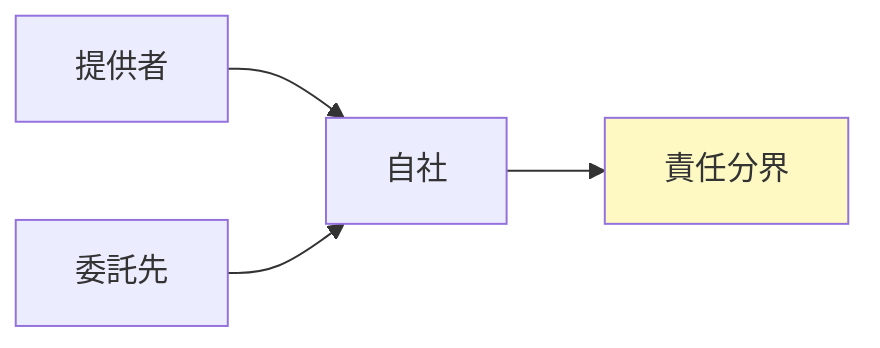

## リード（1段落）

AI-BOM（AI Bill of Materials）は、AIシステムの構成要素・データ・モデル・依存関係を明示し、サプライチェーンリスクと監査可能性を高めるための仕組みです。本稿では**AI-BOM実装を90日で進める手順**に焦点を当て、選定基準、評価プロセス、契約・SLA、継続監視、証跡・監査対応を整理します。実務担当が明日から着手できるステップとチェックリストを示します。

## 本文

### 1. 選定基準（評価軸）

AI-BOMを「何のためにつくるか」で評価軸を決めます。**監査・規制対応、サプライチェーンリスクの可視化、インシデント時の影響範囲特定**のいずれを優先するかで、BOMの粒度と記載項目が変わります。選定基準として、自社のAI利用の成熟度、規制・監査の要求、ベンダー・オープンモデルの利用状況を踏まえ、「まずは高リスク用途からBOMを作り、段階的に拡げる」か「全利用を一括でBOM化する」かを判断します。判断軸を1つ決め、関係者で共有しておくと、実装がぶれません。

ここに図1を挿入

### 2. 評価プロセス（手順）

評価プロセスでは、**既存システムの棚卸→BOMテンプレの選定→入力・更新の責任者と頻度の決定→検証・承認フロー**を順に設計します。90日で進める場合は、30日目までにテンプレと責任者を決め、60日目までに高リスク用途のBOMを1件完成させ、90日目に監査提出用の目次とすり合わせを1回行うロードマップが現実的です。評価プロセスを文書化し、申請―審査―承認の証跡を残すようにします。

ここに図2を挿入

### 3. 契約・SLA

外部モデル・ベンダーを利用している場合は、**BOMの提供義務、更新頻度、機密保持**を契約に盛り込みます。SLAとして、BOMの更新タイミング（リリース時・四半期など）と、提供形式（構造化データ・スプレッドシート等）を決めておくと、継続監視と監査提出がしやすくなります。契約条項はliving clausesとして、規制変更時に見直せるようにしておくことを推奨します。

ここに図3を挿入

### 4. 継続監視と証跡・監査対応

BOMは一度作って終わりではなく、**モデル・データ・依存関係の変更に合わせて更新し、継続監視**します。証跡としては、BOMの版管理、更新履歴、承認記録を残し、監査提出の目次に「AI-BOM一覧と更新記録」を入れておきます。監査法人に提出物の形を事前に1回すり合わせ、責任分界（誰が更新し誰が提出するか）を明示してください。

## 図1（Mermaid）



## 図2（HTML）

```
<div style="max-width: 520px; margin: 1rem auto; border-left: 3px solid #003E68; padding-left: 1rem;">
  <p style="margin: 0 0 0.5rem; font-weight: bold;">90日ロードマップ</p>
  <ul style="margin: 0; padding-left: 1.25rem; font-size: 0.9rem;">
    <li style="margin: 0.25rem 0;">30日：テンプレ・責任者決定、高リスク用途の選定</li>
    <li style="margin: 0.25rem 0;">60日：高リスク1件のBOM完成、更新フロー確立</li>
    <li style="margin: 0.25rem 0;">90日：監査提出目次とのすり合わせ、継続監視の運用開始</li>
  </ul>
</div>
```

## 図3（Table）

```
<table style="width:100%; max-width: 520px; margin: 1rem auto; border-collapse: collapse;">
  <thead>
    <tr style="background: #f1f5f9;">
      <th style="border: 1px solid #cbd5e1; padding: 0.5rem 0.75rem;">証跡</th>
      <th style="border: 1px solid #cbd5e1; padding: 0.5rem 0.75rem;">目的</th>
    </tr>
  </thead>
  <tbody>
    <tr><td style="border: 1px solid #cbd5e1; padding: 0.5rem 0.75rem;">BOM版・更新履歴</td><td style="border: 1px solid #cbd5e1; padding: 0.5rem 0.75rem;">選択の根拠</td></tr>
    <tr><td style="border: 1px solid #cbd5e1; padding: 0.5rem 0.75rem;">承認記録</td><td style="border: 1px solid #cbd5e1; padding: 0.5rem 0.75rem;">通過判断の説明</td></tr>
    <tr><td style="border: 1px solid #cbd5e1; padding: 0.5rem 0.75rem;">契約・SLA記録</td><td style="border: 1px solid #cbd5e1; padding: 0.5rem 0.75rem;">ベンダー責任分界</td></tr>
  </tbody>
</table>
```

## 図の型（記録用・必須）
図1: J, 図2: E, 図3: G

## 図の形式（記録用・必須）
図1: Mermaid, 図2: HTML, 図3: Table

## 固有の一文（要点ボックス用1文）

AI-BOMを「監査で求められる証跡」として位置づけると、**BOMの版管理と更新責任者を決めないまま運用し、提出時に再構成を求められる**事態を防げます。明日から、BOMのテンプレと更新責任者を1人決め、高リスク用途1件で試すことをお勧めします。

## チェックリスト（10項目）

- AI-BOMの目的（監査・サプライチェーン・インシデント）を決めているか
- BOMテンプレと記載項目を選定しているか
- 更新責任者（R）と承認者（A）をRACIで決めているか
- 90日ロードマップ（テンプレ・1件完成・監査すり合わせ）を立てているか
- 契約にBOM提供・更新の義務を盛り込んでいるか（外部利用時）
- BOMの版管理・更新履歴を証跡として保全しているか
- 継続監視の頻度（リリース時・四半期等）を決めているか
- 監査提出の目次にBOMを入れ、事前にすり合わせているか
- 四半期の棚卸でBOMの完全性を点検しているか
- 教育・周知の記録を残しているか

## 参考文献（3つ以上、発行年または一次資料明記）

- ISO/IEC 42001 (AIMS). https://www.iso.org/standard/42001
- 経済産業省「AI事業者ガイドライン」2025年3月公表版. https://www.meti.go.jp/shingikai/mono_info_service/ai_shakai_jisso/pdf/20250328_2.pdf
- NIST AI RMF (2023). https://www.nist.gov/itl/ai-risk-management-framework


## 次の一歩（結論パターン Co に沿って）

放置した場合のワーストシナリオ（監査指摘・証跡欠落）を避けるため、明日から対策を始めてください。（1）AI-BOMの目的を「監査・サプライチェーン・インシデントのどれを優先するか」1つに絞る。（2）BOMテンプレと更新責任者を1人決め、高リスク用途1件で90日ロードマップの1サイクルを回す。（3）完了後に証跡の目次を監査法人と1回すり合わせる。これで他用途への展開の基準ができます。
