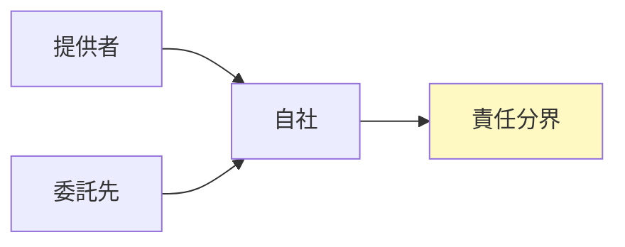

## リード（1段落）

AIシステムは自社開発だけでなく、外部モデル・クラウドAPI・データ提供者に依存することが多く、**供給網の責任分界**が不明確だと監査やインシデント対応で混乱します。本稿では、AI-BOMと供給網の責任分界に焦点を当て、誰が何を保証し、どこまで証跡を求められるかを整理します。集中/分散の選択肢と、契約・証跡で押さえるポイントを比較し、実装の判断軸を提供します。

## 本文

### 1. 供給網の構成と責任の所在

AIの供給網では、**モデル提供者、データ提供者、インフラ（クラウド）、自社**の役割ごとに「誰が何について責任を負うか」を明確にします。責任分界が曖昧だと、障害時や規制対応時に押し付け合いや証跡の欠落が発生します。構成図で関係者を可視化し、各境界で契約・SLA・証跡の要求を決めておきます。自社が責任を負う範囲（利用目的・データ範囲・出力の検証）と、ベンダーに求める保証・ログの範囲を文書化することが第一歩です。

ここに図1を挿入

### 2. 集中型と分散型の比較

**集中型**（社内でモデル・データを一元管理）と**分散型**（部門ごと・クラウドAPI併用）では、責任分界と証跡の設計が異なります。集中型では自社の統制が効きやすい一方、分散型では各利用単位で申請―承認と証跡を揃える必要があります。比較のポイントは、サプライチェーンの長さ、証跡の取得可能性、監査提出時の説明負荷です。自社の組織形態とリスク許容度に合わせて、集中/分散またはハイブリッドを選び、その選択の根拠を記録しておきます。

ここに図2を挿入

### 3. 契約と証跡で押さえるポイント

契約では、**BOM・ログ・インシデント報告の提供義務、データ主権、規制変更時の条項見直し（living clauses）**を盛り込みます。証跡としては、契約書・SLA、ベンダーからの提供物の版・受領記録、自社の検証・承認記録を保全します。越境データの場合は法域ごとの義務をマトリクス化し、契約と証跡でカバーできるようにします。監査提出時には「供給網の責任分界一覧」と「主要ベンダーとの契約・証跡の対応表」を用意しておくと、説明がしやすくなります。

ここに図3を挿入

### 4. 継続監視と棚卸

供給網は変化するため、**四半期ごとの棚卸**で、関係者・契約・証跡の整合を確認します。ベンダー変更やAPI廃止時に、責任分界と証跡の引き継ぎを忘れないようにします。継続監視のKRIとして、契約更新漏れ、BOM未更新、証跡欠落の有無を追うとよいでしょう。いまの対応が、その後の監査対応と競争力の基盤になります。

## 図1（Mermaid）



## 図2（Table）

```
<table style="width:100%; max-width: 520px; margin: 1rem auto; border-collapse: collapse;">
  <thead>
    <tr style="background: #f1f5f9;">
      <th style="border: 1px solid #cbd5e1; padding: 0.5rem 0.75rem;">観点</th>
      <th style="border: 1px solid #cbd5e1; padding: 0.5rem 0.75rem;">集中型</th>
      <th style="border: 1px solid #cbd5e1; padding: 0.5rem 0.75rem;">分散型</th>
    </tr>
  </thead>
  <tbody>
    <tr><td style="border: 1px solid #cbd5e1; padding: 0.5rem 0.75rem;">責任分界</td><td style="border: 1px solid #cbd5e1; padding: 0.5rem 0.75rem;">自社で一元</td><td style="border: 1px solid #cbd5e1; padding: 0.5rem 0.75rem;">利用単位ごと</td></tr>
    <tr><td style="border: 1px solid #cbd5e1; padding: 0.5rem 0.75rem;">証跡</td><td style="border: 1px solid #cbd5e1; padding: 0.5rem 0.75rem;">一元的に取得しやすい</td><td style="border: 1px solid #cbd5e1; padding: 0.5rem 0.75rem;">各単位で揃える必要</td></tr>
  </tbody>
</table>
```

## 図3（HTML）

```
<div style="max-width: 520px; margin: 1rem auto; border-left: 3px solid #003E68; padding-left: 1rem;">
  <p style="margin: 0 0 0.5rem; font-weight: bold;">契約・証跡のポイント</p>
  <ul style="margin: 0; padding-left: 1.25rem; font-size: 0.9rem;">
    <li style="margin: 0.25rem 0;">BOM・ログ・インシデント報告の提供義務を契約に明記</li>
    <li style="margin: 0.25rem 0;">責任分界一覧と契約・証跡の対応表を監査用に準備</li>
    <li style="margin: 0.25rem 0;">四半期で棚卸し、関係者・契約・証跡の整合を確認</li>
  </ul>
</div>
```

## 図の型（記録用・必須）
図1: J, 図2: D, 図3: B

## 図の形式（記録用・必須）
図1: Mermaid, 図2: Table, 図3: HTML

## 固有の一文（要点ボックス用1文）

供給網が長いほど**「どこまでが自社の責任で、どこからがベンダーの責任か」が監査で問われ、契約と証跡が揃っていないと差し戻し**になります。明日から、主要な外部依存について責任分界を1枚にまとめ、契約にBOM・ログ提供義務が入っているか確認することをお勧めします。

## チェックリスト（10項目）

- 供給網の構成（提供者・委託先・自社）を図で可視化しているか
- 各境界の責任分界を文書化しているか
- 契約にBOM・ログ・インシデント報告の提供義務を盛り込んでいるか
- 責任分界一覧と契約・証跡の対応表を用意しているか
- 集中/分散の選択の根拠を記録しているか
- 証跡（契約・受領・検証記録）を改ざん耐性で保全しているか
- 四半期の棚卸で関係者・契約・証跡の整合を確認しているか
- 監査提出の目次に供給網・責任分界を入れているか
- living clausesで規制変更時に契約を見直せるようにしているか
- 教育・周知の記録を残しているか

## 参考文献（3つ以上、発行年または一次資料明記）

- ISO/IEC 42001 (AIMS). https://www.iso.org/standard/42001
- 経済産業省「AI事業者ガイドライン」2025年3月公表版. https://www.meti.go.jp/shingikai/mono_info_service/ai_shakai_jisso/pdf/20250328_2.pdf
- NIST AI RMF (2023). https://www.nist.gov/itl/ai-risk-management-framework


## 次の一歩（結論パターン Co に沿って）

今日のベストプラクティスは明日の最低要件になり得ます。明日から、主要なAI依存（外部モデル・API・データ）について「責任分界一覧」を1枚にまとめ、各ベンダーとの契約にBOM・ログ提供義務が入っているか確認してください。入っていない場合は次回更新時に条項追加を検討し、証跡の目次を監査法人と1回すり合わせておくと、供給網の説明がしやすくなります。
