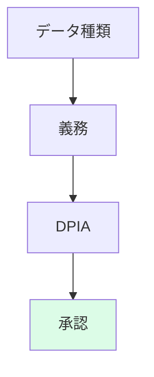

## リード（1段落）

データ統制（データガバナンス）とAI統制は別々に設計されがちですが、**接合点**が曖昧だと、個人情報の取り扱いや学習データの品質で抜け穴が生じます。本稿では、データ統制とAI統制の接合点に焦点を当て、何が論点か、運用、証跡、チェックリストを整理します。複数ステークホルダーが参照できるように、全体像と実装の導線を示します。

## 本文

### 1. 何が論点か

接合点の論点は、**データの分類（個人情報・機密・一般）とAI利用目的の対応**、**学習・推論でのデータ境界**、**データ品質（GIGO）とAI評価の連動**、**越境・共同研究時の責任分界**です。データガバナンスで決めた保持期間・アクセス制御・目的外利用禁止を、AIの利用申請・承認・証跡にどう反映するかを明文化します。論点を一覧化し、データ担当とAI統制担当の責任分界（RACI）を決めておかないと、監査やインシデント時に説明が曖昧になります。

ここに図1を挿入

### 2. 運用

運用では、**AI利用申請時にデータの種類と利用目的を明示させ、データガバナンスの承認フロー（例：個人情報ならDPIA・承認）と連携**させます。学習データの取得・利用・破棄の記録を証跡として残し、データ品質の評価結果とAIの評価（エvals）を紐づけておくと、監査で「データからAIまで一貫した統制」を説明しやすくなります。継続評価として、データとAIの両方のKRI（品質指標、利用件数、是正率）を追うとよいでしょう。

ここに図2を挿入

### 3. 証跡

証跡の最小セットには、**データ分類一覧、AI利用とデータの対応表、DPIA・承認記録、学習・推論のデータ境界の記録、品質・評価の記録**を含めます。データ統制とAI統制の接合点を「証跡の目次」の1項目として明示し、監査法人と事前にすり合わせておきます。証跡の保管責任者と提出窓口を1人決め、改ざん耐性と保持期間を確保してください。

ここに図3を挿入

### 4. チェックリスト

実装の勘所を、データ担当とAI統制担当の両方が使えるチェックリストにします。データ分類とAI利用目的の対応、申請―承認フローとの連携、証跡の目次と監査すり合わせ、継続評価の記録、是正の流れを押さえ、教育・周知の記録を残します。この接合点を押さえておくことで、いまの対応がその後の監査対応と競争力の基盤になります。

## 図1（Mermaid）



## 図2（HTML）

```
<div style="max-width: 520px; margin: 1rem auto; border-left: 3px solid #003E68; padding-left: 1rem;">
  <p style="margin: 0 0 0.5rem; font-weight: bold;">運用のポイント</p>
  <ul style="margin: 0; padding-left: 1.25rem; font-size: 0.9rem;">
    <li style="margin: 0.25rem 0;">AI利用申請でデータ種類・利用目的を明示し、データ承認と連携</li>
    <li style="margin: 0.25rem 0;">学習・推論のデータ境界と品質・評価を記録</li>
    <li style="margin: 0.25rem 0;">証跡の目次に「データとAIの接合点」を入れ、監査とすり合わせ</li>
  </ul>
</div>
```

## 図3（Table）

```
<table style="width:100%; max-width: 520px; margin: 1rem auto; border-collapse: collapse;">
  <thead>
    <tr style="background: #f1f5f9;">
      <th style="border: 1px solid #cbd5e1; padding: 0.5rem 0.75rem;">証跡</th>
      <th style="border: 1px solid #cbd5e1; padding: 0.5rem 0.75rem;">目的</th>
    </tr>
  </thead>
  <tbody>
    <tr><td style="border: 1px solid #cbd5e1; padding: 0.5rem 0.75rem;">データ分類・AI利用対応表</td><td style="border: 1px solid #cbd5e1; padding: 0.5rem 0.75rem;">接合点の説明</td></tr>
    <tr><td style="border: 1px solid #cbd5e1; padding: 0.5rem 0.75rem;">DPIA・承認記録</td><td style="border: 1px solid #cbd5e1; padding: 0.5rem 0.75rem;">通過判断の説明</td></tr>
    <tr><td style="border: 1px solid #cbd5e1; padding: 0.5rem 0.75rem;">品質・評価記録</td><td style="border: 1px solid #cbd5e1; padding: 0.5rem 0.75rem;">データとAIの一貫性</td></tr>
  </tbody>
</table>
```

## 図の型（記録用・必須）
図1: D, 図2: B, 図3: G

## 図の形式（記録用・必須）
図1: Mermaid, 図2: HTML, 図3: Table

## 固有の一文（要点ボックス用1文）

データ統制とAI統制を**「データ分類とAI利用目的の対応表」と「申請フローとの連携」**で接合しておかないと、監査で「個人データをAIでどう扱っているか」を説明する際に証跡が散在し、差し戻しになります。明日から、その対応表を1枚つくり、データ担当とAI統制担当の責任分界を1回決めることをお勧めします。

## チェックリスト（10項目）

- データ分類（個人情報・機密・一般）とAI利用目的の対応を一覧化しているか
- データ担当とAI統制担当のRACIを決めているか
- AI利用申請でデータ種類・利用目的を明示させ、データ承認と連携しているか
- 学習・推論のデータ境界を文書化し、記録しているか
- DPIA・承認記録を証跡として保全しているか
- データ品質とAI評価の記録を紐づけているか
- 証跡の目次に「データとAIの接合点」を入れ、監査とすり合わせているか
- 継続評価のKRIをデータ・AIの両方で追っているか
- 是正の流れをテンプレ化し、記録しているか
- 教育・周知の記録を残しているか

## 参考文献（3つ以上、発行年または一次資料明記）

- GDPR（EU一般データ保護規則）. https://eur-lex.europa.eu/legal-content/EN/TXT/?uri=CELEX:32016R0679
- ISO/IEC 42001 (AIMS). https://www.iso.org/standard/42001
- 経済産業省「AI事業者ガイドライン」2025年3月公表版. https://www.meti.go.jp/shingikai/mono_info_service/ai_shakai_jisso/pdf/20250328_2.pdf


## 次の一歩（結論パターン Co に沿って）

あなたの組織がどの道を選ぶべきか、判断軸を1つ決めてください。「まずはデータ分類とAI利用の対応表を1枚つくり、データ担当とAI統制担当の責任分界を決める」か、「既存のAI利用を棚卸し、データ境界と証跡の欠落を洗い出してから接合点を設計する」かです。どちらにしても、証跡の目次に接合点を明示し、監査法人に1回確認することを推奨します。
