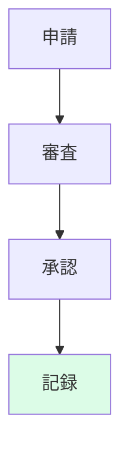

## リード（1段落）

AI倫理委員会を設置しても、**議題が抽象論に終わり、承認フローや証跡に落ちない**ため形骸化する事例があります。本稿では、AI倫理委員会が形骸化しない設計に焦点を当て、委員会の役割、開発統制との接続、証跡、チェックリストを整理します。実務担当が明日から使える、会議体と手続きの設計の勘所を示します。

## 本文

### 1. 開発での落とし穴

委員会が形骸化する落とし穴は、**議題が理念のみで終わり、具体的な承認基準・フロー・証跡が決まらない**ことです。ほかに、委員会の結論と開発の承認ゲートがつながっておらず、委員会で「検討する」と言ったままリリースされてしまうケース、委員の役割（RACI）が曖昧で誰が説明責任を負うか不明なケースがあります。開発フェーズでは、委員会のアウトプット（承認・条件付き承認・差し戻し）を開発のゲートに組み込み、証跡を残す設計にすることが求められます。

ここに図1を挿入

### 2. 統制

委員会を**統制の一部**として位置づけ、方針（何を委員会で見るか）→プロセス（申請・審査・承認の流れ）→証跡（議事録・承認記録・条件の記録）を一貫させます。統制のポイントは、委員会の権限範囲（全AIか高リスクのみか）、審査基準の明文化、承認・条件付き承認・差し戻しの区分と、それぞれに応じた開発側のアクションです。委員会の結論を開発のリリース承認や継続評価に反映させるフローを文書化し、責任者を決めておきます。

ここに図2を挿入

### 3. 証跡

委員会に関連する証跡には、**議事録、承認・条件付き・差し戻しの記録、審査基準の版管理、開発側の対応記録（条件の充足・是正）**を含めます。証跡の連鎖が切れないよう、委員会のアウトプットと開発のゲート通過記録を紐づけ、監査提出の目次に「倫理委員会関連証跡」を入れます。証跡の保管責任者を1人決め、改ざん耐性と保持期間を確保してください。

ここに図3を挿入

### 4. チェックリスト

委員会が形骸化しないためのチェックリストとして、委員会の権限と審査基準の明文化、申請―審査―承認フローと開発ゲートとの接続、議事録・承認記録の保全、継続評価（委員会で見た案件の事後フォロー）の記録、教育・周知を押さえます。委員会の役割を「理念の議論」だけでなく「承認・条件・差し戻しと証跡」に落とし込むことで、監査でも説明しやすい設計になります。

## 図1（SVG）

```
<svg viewBox="0 0 260 140" xmlns="http://www.w3.org/2000/svg">
  <rect x="40" y="12" width="180" height="32" rx="4" fill="#e0f2fe"/>
  <text x="130" y="32" text-anchor="middle" font-size="10">方針</text>
  <rect x="40" y="52" width="180" height="32" rx="4" fill="#dcfce7"/>
  <text x="130" y="72" text-anchor="middle" font-size="10">プロセス</text>
  <rect x="40" y="92" width="180" height="32" rx="4" fill="#fef9c3"/>
  <text x="130" y="112" text-anchor="middle" font-size="10">証跡</text>
</svg>
```

## 図2（Mermaid）



## 図3（Table）

```
<table style="width:100%; max-width: 520px; margin: 1rem auto; border-collapse: collapse;">
  <thead>
    <tr style="background: #f1f5f9;">
      <th style="border: 1px solid #cbd5e1; padding: 0.5rem 0.75rem;">証跡</th>
      <th style="border: 1px solid #cbd5e1; padding: 0.5rem 0.75rem;">目的</th>
    </tr>
  </thead>
  <tbody>
    <tr><td style="border: 1px solid #cbd5e1; padding: 0.5rem 0.75rem;">議事録・承認記録</td><td style="border: 1px solid #cbd5e1; padding: 0.5rem 0.75rem;">通過判断の説明</td></tr>
    <tr><td style="border: 1px solid #cbd5e1; padding: 0.5rem 0.75rem;">審査基準の版管理</td><td style="border: 1px solid #cbd5e1; padding: 0.5rem 0.75rem;">選択の根拠</td></tr>
    <tr><td style="border: 1px solid #cbd5e1; padding: 0.5rem 0.75rem;">開発側の対応記録</td><td style="border: 1px solid #cbd5e1; padding: 0.5rem 0.75rem;">条件充足・是正</td></tr>
  </tbody>
</table>
```

## 図の型（記録用・必須）
図1: A, 図2: B, 図3: G

## 図の形式（記録用・必須）
図1: SVG, 図2: Mermaid, 図3: Table

## 固有の一文（要点ボックス用1文）

倫理委員会の形骸化の多くは、**委員会の結論と開発のリリース承認ゲートがつながっておらず、「検討した」で終わり証跡が残らない**ことが原因です。明日から、委員会のアウトプット（承認・条件・差し戻し）を開発のゲートに1つ紐づけ、議事録と承認記録を必ず残すルールにしてください。

## チェックリスト（10項目）

- 委員会の権限範囲と審査基準を文書化しているか
- 申請―審査―承認フローを決め、開発のゲートと接続しているか
- 委員会のRACI（委員・事務局・説明責任者）を決めているか
- 議事録・承認・条件付き・差し戻しの記録を保全しているか
- 委員会の結論に応じた開発側のアクションを記録しているか
- 審査基準の版管理をしているか
- 継続評価（委員会で見た案件の事後フォロー）を記録しているか
- 証跡の目次に「倫理委員会関連」を入れ、監査とすり合わせているか
- 四半期で委員会の効果（承認件数・条件・差し戻し）を点検しているか
- 教育・周知の記録を残しているか

## 参考文献（3つ以上、発行年または一次資料明記）

- NIST AI RMF (2023). https://www.nist.gov/itl/ai-risk-management-framework
- ISO/IEC 42001 (AIMS). https://www.iso.org/standard/42001
- G7広島AIプロセス. https://www.meti.go.jp/shingikai/mono_info_service/ai_shakai_jisso/pdf/20231030_3.pdf


## 次の一歩（結論パターン Co に沿って）

いまの対応が、その後の監査対応と競争力の基盤になります。明日から、（1）委員会のアウトプット（承認・条件付き・差し戻し）を開発のリリース承認ゲートに1つ紐づける。（2）議事録と承認記録を必ず残すルールを決め、保管責任者を1人決める。（3）証跡の目次に「倫理委員会関連」を追加し、監査法人に1回確認する。委員会が形骸化せず、説明可能な設計に変わります。
