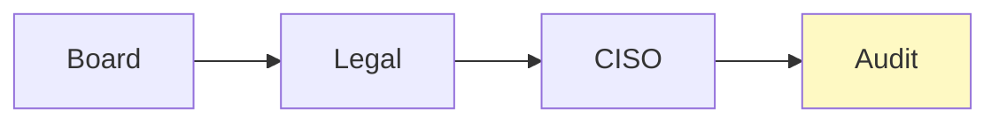

## リード（1段落）

「AI倫理原則を掲げる企業ほど、実装で躓く」と言われることがあります。理念と手続きの断絶を埋めるには、**倫理原則を申請・審査・承認・証跡・継続評価に変換する**必要があります。本稿では、AI倫理原則を手続きに変換することに焦点を当て、なぜAIで三線が崩れるか、RACI最小セット、例外が燃える構造と封じ方、実装チェックリストを整理します。

## 本文

### 1. なぜAIで三線が崩れるか

三線防衛（1線＝業務、2線＝リスク・コンプラ、3線＝監査）は、従来は業務プロセスと規程で役割が分かれます。AI利用では、**開発・利用が現場に分散し、2線の審査が後追いになったり、3線が求める証跡が揃っていない**ことがあります。その結果、誰が最終判断するか曖昧になり、例外が増え、証跡が欠落します。理念（倫理原則）だけでは、この崩れは止まりません。手続きとして「誰が申請し、誰が審査し、誰が承認するか」と「何を証跡として残すか」を決める必要があります。

ここに図1を挿入

### 2. RACI最小セット

倫理原則を手続きに落とすには、**RACI（責任者）の最小セット**を決めます。Board（方針承認）、Legal/Compliance（規制・倫理の解釈）、CISO（セキュリティ）、Audit（監査）、BU（申請者）、IT（実行支援）のうち、自社に必要な役割を選び、AI利用の申請・審査・承認・証跡・継続評価のそれぞれにRとAを割り当てます。RACIを1枚にまとめ、関係者と共有しておくことで、「理念で終わらせず運用に落とす」第一歩になります。

ここに図2を挿入

### 3. 例外が燃える構造と封じ方

例外（緊急利用・一時的な逸脱）が増えすぎると、統制が形骸化します。**例外の基準、有効期限、審査者、棚卸の頻度**を明文化し、例外申請とその承認記録を証跡として残します。例外が「燃える」構造とは、基準が曖昧で例外だらけになり、監査で指摘される状態です。封じるには、例外の定義を狭くし、四半期で例外一覧を棚卸して恒久化すべきものは正式申請に切り替える運用にします。

ここに図3を挿入

### 4. 実装チェックリスト

理念を手続きに変換したかどうかを確認するチェックリストとして、倫理原則と申請―審査―承認フローの対応、RACIの明示、例外の基準と有効期限、証跡の目次と監査すり合わせ、継続評価・インシデントの記録、教育・周知を押さえます。このチェックリストで未実施の項目を1つずつ埋めていくことで、倫理原則が運用に落ちた設計になります。

## 図1（Mermaid）



## 図2（HTML）

```
<div style="max-width: 520px; margin: 1rem auto; border-left: 3px solid #003E68; padding-left: 1rem;">
  <p style="margin: 0 0 0.5rem; font-weight: bold;">手続き化のポイント</p>
  <ul style="margin: 0; padding-left: 1.25rem; font-size: 0.9rem;">
    <li style="margin: 0.25rem 0;">RACIを1枚にまとめ、申請・審査・承認・証跡に割り当て</li>
    <li style="margin: 0.25rem 0;">例外の基準・有効期限・棚卸を決め、記録を残す</li>
    <li style="margin: 0.25rem 0;">証跡の目次を監査と事前合意</li>
  </ul>
</div>
```

## 図3（Table）

```
<table style="width:100%; max-width: 520px; margin: 1rem auto; border-collapse: collapse;">
  <thead>
    <tr style="background: #f1f5f9;">
      <th style="border: 1px solid #cbd5e1; padding: 0.5rem 0.75rem;">差し戻し要因</th>
      <th style="border: 1px solid #cbd5e1; padding: 0.5rem 0.75rem;">対策</th>
    </tr>
  </thead>
  <tbody>
    <tr><td style="border: 1px solid #cbd5e1; padding: 0.5rem 0.75rem;">責任者不明</td><td style="border: 1px solid #cbd5e1; padding: 0.5rem 0.75rem;">RACIの明示</td></tr>
    <tr><td style="border: 1px solid #cbd5e1; padding: 0.5rem 0.75rem;">証跡欠落</td><td style="border: 1px solid #cbd5e1; padding: 0.5rem 0.75rem;">目次の事前すり合わせ</td></tr>
    <tr><td style="border: 1px solid #cbd5e1; padding: 0.5rem 0.75rem;">例外だらけ</td><td style="border: 1px solid #cbd5e1; padding: 0.5rem 0.75rem;">基準・有効期限・棚卸</td></tr>
  </tbody>
</table>
```

## 図の型（記録用・必須）
図1: C, 図2: B, 図3: F

## 図の形式（記録用・必須）
図1: Mermaid, 図2: HTML, 図3: Table

## 固有の一文（要点ボックス用1文）

倫理原則を**「申請―審査―承認のフロー」と「証跡の目次」に1対1で対応させない**と、理念は掲げたが手続きが追いつかず、監査で「何をやったか説明できない」と指摘されます。明日から、自社の倫理原則の各項目に、対応する手続きと証跡を1つずつ書き添えてください。

## チェックリスト（10項目）

- 倫理原則と申請―審査―承認フローの対応を文書化しているか
- RACI（Board/Legal/CISO/Audit/BU/IT等）を決め、1枚にまとめているか
- 例外の基準と有効期限を決め、四半期で棚卸しているか
- 証跡を改ざん耐性で保全しているか
- 証跡の目次を監査法人と事前にすり合わせているか
- 継続評価の記録を残しているか
- インシデント時の報告・エスカレーション手順があるか
- 規制・標準との対応関係を一覧化しているか（断定は避ける）
- 四半期の棚卸を予定しているか
- 教育・周知の記録を残しているか

## 参考文献（3つ以上、発行年または一次資料明記）

- NIST AI RMF (2023). https://www.nist.gov/itl/ai-risk-management-framework
- ISO/IEC 42001 (AIMS). https://www.iso.org/standard/42001
- 経済産業省「AI事業者ガイドライン」2025年3月公表版. https://www.meti.go.jp/shingikai/mono_info_service/ai_shakai_jisso/pdf/20250328_2.pdf


## 次の一歩（結論パターン Co に沿って）

放置した場合のワーストシナリオ（監査指摘・証跡欠落）を避けるため、明日から対策を始めてください。（1）倫理原則の各項目に、対応する手続き（申請・審査・承認のどれか）と証跡を1つずつ書き添える。（2）RACIを1枚にまとめ、関係者と共有する。（3）証跡の目次を1枚にし、監査法人に事前に1回確認する。理念と手続きの断絶が埋まり、説明可能な設計に近づきます。
